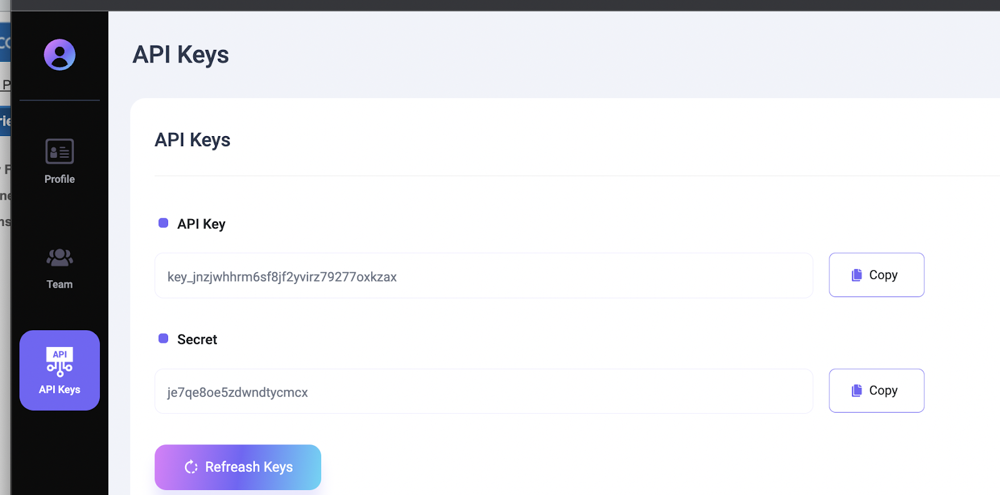

---
---

# 1. Getting Started

The LayerNext Python SDK provides a programmatic way to access all the functions inside the LayerNext platform, including uploading annotations, downloading datasets and annotations, and other functions.

## 1.1. Installation

The SDK is available as a package on PyPI

```bash
pip install layerx-sdk
```

## 1.2. API Keys

To use the SDK, you will need your LayerNxt API Key and Secret. Those can be found and copied from the **API Keys** section in your account's UI.



## 1.3. Setting up the SDK

Before you start, you will have to create a `client` instance with permissions to access your account. You will need the API Key and Secret as detailed above, as well as the domain where your data is hosted.

```python
url = "https://api.[customer_sub_domain].layerx.ai"
client = layerx.LayerxClient(api_key, secret, url)
```

Then, the created API client can use the available functions inside this SDK reference.

You can find more information in the github repository here: https://github.com/LayerX-AI/layerx-python-sdk

## 1.4. Tracking the Completion of Operations

Some of the functions in the SDK trigger operations or jobs in the Data Lake that run in the background and may take several minutes to finish. If your program needs to wait for these operations to complete, you can use the 'wait_for_job_complete' function. This function will cause your program to pause until the job has been fully executed.

```python
client.wait_for_job_complete(job_id)
```
## Parameters

| Parameter          | Data type         | Default          | Description         |
| ------------------ | ------------------ | ------------------ | ---------------------------------------------------------------------------------------------------------------------------------------- |
| `job_id`             | string | - | Job Id corresponding to the operation invoked in a previous SDK function (eg: Project creation) |

## Returns

Status of the job (complete or fail) once the job is done

```python
{
    'is_success': True/False, 
    'job_status': 'COMPLETED/FAILED', 
}
```

## Example usage

```python
upload_res = client.upload_files_to_collection(‘/home/user/images', “image”, “my_collection”, {})
upload_job_id = upload_res['job_id']

#Waiting for upload processing to complete
client.wait_for_job_complete(upload_job_id)
```
