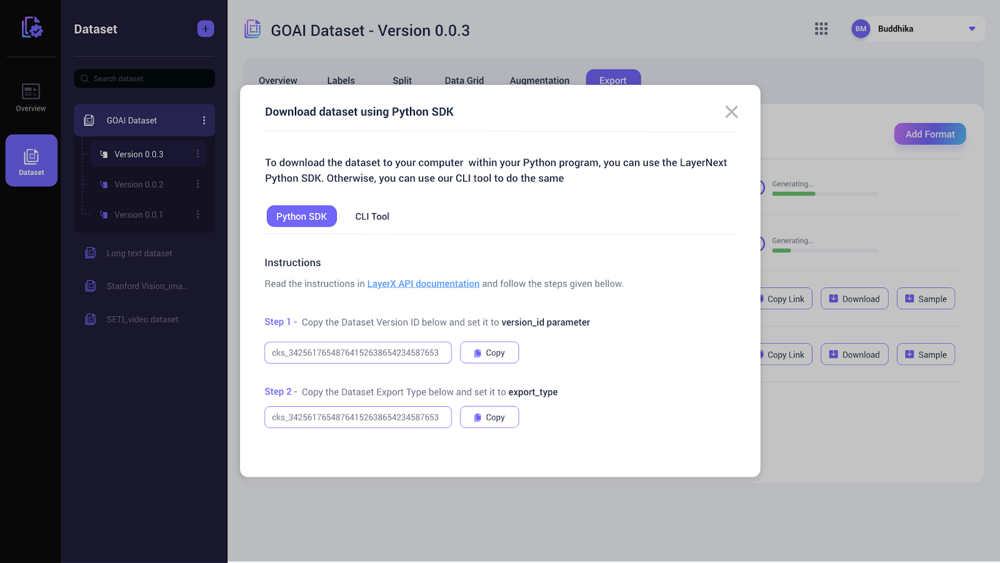

---
---

# 5. Datasets

## 5.1. Downloading Datasets

You can use the "download_dataset" method in the Python SDK to download the datasets that were created in the Dataset Manager App. The following information is needed:

###### 1. Id of the dataset version: `version_id`
###### 2. Dataset export format: `export_type`

You can easily copy these values from the LayerNext Dataset Manager tool by accessing the ‘Download dataset using the Python SDK’ as shown below:



```python
download_dataset(version_id, export_type)
```

## Example Usage

```python
client.download_dataset("635eafbec1a605ab795d2768", "YOLO Darknet")
```

## 5.2. Create a Dataset from a Collection

This SDK function creates a dataset from all or a subset of frames in a given collection in the DataLake.


```python
create_dataset_from_collection(dataset_name: str, collection_id: str, split_info:dict, labels:list, export_types:list,  query: str, filter:dict, operation_list: list, augmentation_list: list)
```

## Parameters

| Parameter          | Data type         | Default          | Description        |
| ------------------ | ------------------ | ------------------ | ---------------------------------------------------------------------------------------------------------------------------------------- |
| `dataset_name`     | string | - | Dataset name (should be non-empty) |
| `collection_id`     | string | - | Collection ID from which data is input to create the dataset |
| `split_info`     | dictionary | - | Percentage of frames assigned for each of the portions of dataset: train, test and validation. Should be given as dictionary with train/test/validation as key and percentage as value. |
| `labels`     | list | - | The labels belong to the dataset. At least one label should be given. |
| `export_types` (Optional)     | list | [] | List of formats to which the exports should be generated. Available export types are "RAW", "YOLO Darknet", "Semantic Segmentation"  |
| `query` (Optional)     | string | empl| The search query that filters the items in the collection (This is the same query format that we use in the Data Lake frontend ) |
| `filter` (Optional)     | object | - | Additional criteria can be specified in the filter object as similar to annotation project creation |
| `operation_list` (Optional)     | list | None | The Ids of annotation projects or model runs that are included in the dataset. If this is None, then all available projects or model runs associated with selected images are taken. If this is empty, then none of the annotations are included. |
| `augmentation_list` (Optional)     | object | None | Dictionary containing the configurations for different types of augmentations enabled for this dataset. The details on augmentation configuration is given in the section 5.6 |

## Example Usage

```python
#This will create a dataset called "Balloons Dataset" from all frames in a collection and export to RAW and Semantic Segmentation
client.create_dataset_from_collection("Balloons Dataset", "<datalake_collection_id>", {"train":100, "test":0, "validation":0}, ["Balloon"], ["RAW","Semantic Segmentation"])
```

## 5.3. Create a Dataset Without Giving a Collection

This SDK function creates a dataset from a subset of frames in the DataLake without specifying a collection.


```python
create_dataset_from_datalake(dataset_name: str, split_info:dict, labels:list, export_types:list, item_type:str,  query: str, filter:dict)
```

## Parameters

| Parameter          | Data type         | Default          | Description        |
| ------------------ | ------------------ | ------------------ | ---------------------------------------------------------------------------------------------------------------------------------------- |
| `dataset_name`     | string | - | Dataset name (should be non-empty) |
| `split_info`     | dictionary | - | Percentage of frames assigned for each of the portions of dataset: train, test and validation. Should be given as dictionary with train/test/validation as key and percentage as value. |
| `labels`     | list | - | The labels belong to the dataset. At least one label should be given. |
| `export_types` (Optional)     | list | [] | List of formats to which the exports should be generated. Available export types are "RAW", "YOLO Darknet", "Semantic Segmentation"  |
| `item_type`     | string | image | Valid values are “image” or "image_collection" or "dataset" |
| `query` (Optional)     | string | empl| The search query that filters the items in the collection (This is the same query format that we use in the Data Lake frontend ) |
| `filter` (Optional)     | object | - | Additional criteria can be specified in the filter object as similar to annotation project creation |
| `operation_list` (Optional)     | list | None | The Ids of annotation projects or model runs that are included in the dataset. If this is None, then all available projects or model runs associated with selected images are taken. If this is empty, then none of the annotations are included. |
| `augmentation_list` (Optional)     | object | None | Dictionary containing the configurations for different types of augmentations enabled for this dataset. The details on augmentation configuration is given in the section 5.6 |

## Example Usage

```python
#This will create a dataset called "Balloons Dataset - V2" from all images with Balloon annotations and export to Semantic Segmentation
client.create_dataset_from_datalake("Balloons Dataset - V2", {"train":100, "test":0, "validation":0}, ["Balloon"], ["Semantic Segmentation", "YOLO Darknet"], "image", "annotation.label=Balloon")
```

## 5.4. Update a Dataset Version with Images from a Collection

This SDK function updates an existing dataset with new data from a given collection.

```python
update_dataset_version_from_collection(dataset_version_id:str, collection_id: str, split_info:dict, labels:list, export_types:list,  query: str, filter:dict, is_new_version_required:bool, operation_list: list, augmentation_list: list)
```

## Parameters

| Parameter          | Data type         | Default          | Description        |
| ------------------ | ------------------ | ------------------ | ---------------------------------------------------------------------------------------------------------------------------------------- |
| `dataset_id`     | string | - | Dataset ID |
| `version_id`     | string | - | ID of the current dataset version (source version) |
| `collection_id`     | string | - | Collection ID from which data is input to update the dataset |
| `split_info`     | dictionary | - | Percentage of frames assigned for each of the portions of dataset: train, test and validation. Should be given as dictionary with train/test/validation as key and percentage as value. |
| `labels`     | list | - | The labels belong to the dataset. At least one label should be given. |
| `export_types` (Optional)     | list | [] | List of formats to which the exports should be generated. Available export types are "RAW", "YOLO Darknet", "Semantic Segmentation"  |
| `query` (Optional)     | string | {} | The search query that filters the items in the collection (This is the same query format that we use in the Data Lake frontend ) |
| `filter` (Optional)     | object | - | Additional criteria can be specified in the filter object as similar to annotation project creation |
| `is_new_version_required` (Optional)     | boolean | - | True if new version of dataset to be created |
| `operation_list` (Optional)     | list | None | The Ids of annotation projects or model runs that are included in the dataset. If this is None, then all available projects or model runs associated with selected images are taken. If this is empty, then none of the annotations are included. |
| `augmentation_list` (Optional)     | object | None | Dictionary containing the configurations for different types of augmentations enabled for this dataset. The details on augmentation configuration is given in the section 5.6 |

## Example Usage

```python
#This will update an existing a dataset from all frames in a collection and create a new version
client.create_dataset_from_collection("<dataset_id>", "<current_dataset_version_id>", "<datalake_collection_id>", {"train":100, "test":0, "validation":0}, ["Balloon"], ["RAW","Semantic Segmentation"], "", {}, True)
```


## 5.5. Update a Dataset Version from frames Without Giving a Collection

This SDK function updates a dataset from a subset of frames in the DataLake without specifying a collection.


```python
update_dataset_version_from_datalake(dataset_version_id: str, split_info:dict, labels:list, export_types:list, item_type:str,  query: str, filter:dict, is_new_version_required: bool operation_list: list, augmentation_list: list)
```

## Parameters

| Parameter          | Data type         | Default          | Description        |
| ------------------ | ------------------ | ------------------ | ---------------------------------------------------------------------------------------------------------------------------------------- |
| `dataset_version_id`     | string | - | ID of the current dataset version (source version) |
| `split_info`     | dictionary | - | Percentage of frames assigned for each of the portions of dataset: train, test and validation. Should be given as dictionary with train/test/validation as key and percentage as value. |
| `labels`     | list | - | The labels belong to the dataset. At least one label should be given. |
| `export_types` (Optional)     | list | [] | List of formats to which the exports should be generated. Available export types are "RAW", "YOLO Darknet", "Semantic Segmentation"  |
| `item_type`     | string | image | Valid values are “image” or "image_collection" or "dataset" |
| `query` (Optional)     | string | empl| The search query that filters the items in the collection (This is the same query format that we use in the Data Lake frontend ) |
| `filter` (Optional)     | object | - | Additional criteria can be specified in the filter object as similar to annotation project creation |
| `is_new_version_required` (Optional)     | boolean | - | True if new version of dataset to be created |
| `operation_list` (Optional)     | list | None | The Ids of annotation projects or model runs that are included in the dataset. If this is None, then all available projects or model runs associated with selected images are taken. If this is empty, then none of the annotations are included. |
| `augmentation_list` (Optional)     | object | None | Dictionary containing the configurations for different types of augmentations enabled for this dataset. The details on augmentation configuration is given in the section 5.6 |

## Example Usage

```python
client.update_dataset_version_from_datalake("<dataset_version_id>", {"train":60, "test":30, "validation":10}, ["Balloon"], ["RAW"], "image", "annotation.label=Balloon")
```

## 5.6. Configuring Augmentations

When creating or updating a dataset, the configuration of augmentation options should be provided as a dictionary that represents a JSON structure. The JSON format should follow the structure shown below.

```python
{
    "<AUGMENTATION_CATEGORY>": [
        {
            "id": "<AUGMENTATION_TYPE_ID>",
            "properties": [
                {
                    "id": "<PROPERTY_ID1>",
                    "values": [
                        <VALUE_1>,
                        <VALUE_2>
                    ]
                },
                {
                    "id": "<PROPERTY_ID2>",
                    "values": [
                        <VALUE_1>
                    ]
                }
            ]
        },
        {
            <Configuration for next augmentation type>
        }
    ]
}
```

Note that currently LayerNext supports only one Augmentation category - IMAGE_LEVEL.

The available augmentation types and their properties are listed in below table.

| Type ID         | Property ID        | Description          | Value type | Valid values or value ranges        |
| ------------------ | ------------------ | ------------------------------------------------------ | ----------------- | ---------------------------|
| `FLIP_IMAGE`     | FLIP_HORIZONTAL | If this is True, horizontal flip will be applied, otherwise no operation applied. | Boolean  | True, False |
|      | FLIP_VERTICAL | If this is True, vertical flip will be applied, otherwise no operation applied. | Boolean  | True, False |
| `IMAGE_ROTATION`     | PERCENTAGE_SCALE | Image will be rotated at an angle within the given maximum and minimum limit. | Array of Integer  | Two angles within the range -360 to 36  0 (eg: -10, 30) |
| `IMAGE_BLUR`     | BLUR | The image will undergo Gaussian blurring, with a radius that falls within the specified minimum and maximum limits. | Array of integer  | Maximum and minimum radius within the range -180 to 180 (eg: -10, 30) |
| `NINETY_ROTATION`     | CLOCKWISE | The image will be rotated 90° clockwise if this True, otherwise no operation applied. | Boolean  | True, False |
|      | COUNTER_CLOCKWISE | The image will be rotated 90° anticlockwise if this True, otherwise no operation applied. | Boolean  | True, False |
|      | UPSIDE_DOWN | The image will be rotated upside down if this True, otherwise no operation applied. | Boolean  | True, False |
| `GRAYSCALE`     | GRAYSCALE_PERCENTAGE | Maximum and minimum percentage of grey scaling applied. | Array of Integer  | Maximum and minimum percentage within the range 0 to 100 |
| `HUE`     | HUE_DEGREES | Maximum and minimum degree of hue applied. | Array of Integer  | Pair of the degrees within the range -100 to 100 |
| `SATURATION`     | SATURATION_DEGREES | Maximum and minimum degree of saturation applied. | Array of Integer  | Maximum and minimum degree within the range -100 to 100 |
| `BRIGHTNESS`     | BRIGHTNESS_DEGREES | Maximum and minimum degree of brightness applied. | Array of Integer  |Pair of degrees within the range -100 to 100 |
| `NOISE`     | NOISE_PERCENTAGE | Maximum and minimum percentage of noise applied. | Array of Integer  | Pair of percentages within the range 0 to 100 |
| `SHEAR`     | SHEAR_HORIZONTAL | Maximum and minimum horizontal shear angle | Array of Integer  | Pair of angles from -90 to 90 |
|      | SHEAR_VERTICAL | Maximum and minimum vertical shear angle | Array of Integer  | Pair of angles from -90 to 90 |
| `CROP`     | CROP_PERCENTAGE | Maximum and minimum percentage of crop applied. | Array of Integer  | Pair of percentages within the range 0 to 100 |

## Example Augmentation configuration dictionary

```python
{
    "IMAGE_LEVEL": [
        {
            "id": "FLIP_IMAGE",
            "properties": [
                {
                    "id": "FLIP_HORIZONTAL",
                    "values": [
                        False
                    ]
                },
                {
                    "id": "FLIP_VERTICAL",
                    "values": [
                        True
                    ]
                }
            ]
        },
        {
            "id": "IMAGE_ROTATION",
            "properties": [
                {
                    "id": "PERCENTAGE_SCALE",
                    "values": [
                        -10,
                        30
                    ]
                }
            ]
        },
        {
            "id": "GRAYSCALE",
            "description": "",
            "isSelected": True,
            "properties": [
                {
                    "id": "GRAYSCALE_PERCENTAGE",
                    "values": [
                        5,
                        10
                    ]
                }
            ]
        }
    ]
    }
    ```
