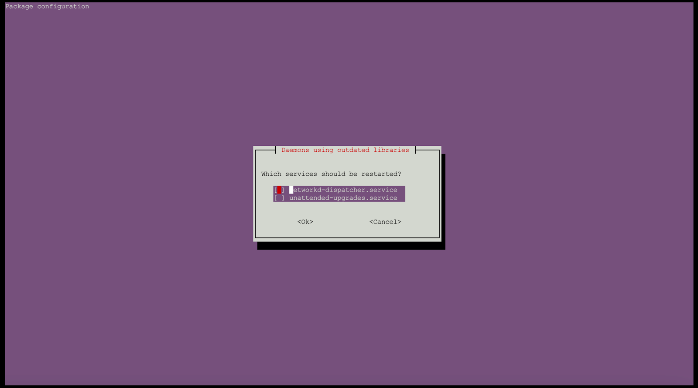

---
---

# Prerequisites

1. Registration key obtained by signing up for the community version.
2. You should have an AWS S3 bucket to store your data. You need to have the following
information in order to connect to your S3 bucket.

-   AWS S3 Access Key
-   AWS S3 Secret Key
-   AWS Region
-   S3 Bucket Name

3. A server with these requirements

-   Ubuntu 64 bit (x86) - Recommended to use 20.04
-   At Least 50GB free disk space
-   HTTP and HTTPS traffic allowed
-   Sudo enabled user who can login via SSH
-   Public ip address associate with server (eg: 54.83.168.141)

# Installation Steps

1. Connect to the server’s terminal via SSH
2. Download the automated deployment wizard (Python script) to the server with command

```bash
“curl --location --request GET 'https://cms.layernext.ai/api/download/deployment/script' -o layernext-self-install.py”
```
3. Run the wizard as

```bash
“python3 layernext-self-install.py”
```

4. Please proceed with the wizard and provide responses to the questions posed. Make sure you remember the **admin email and password** you enter.

Note: If you see a screen like below, please press Enter key.



5. The deployment will take approximately 20 minutes to complete. The time may vary based on the server’s performance.
6. Once the deployment is complete, you will see a success message and will be able to log in to the system via your browser.


